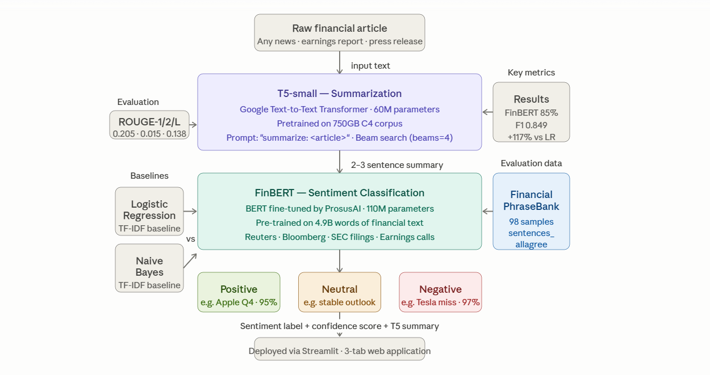

# FinSight NLP — Financial News Summarization and Sentiment Classification

**DATA 641 · Natural Language Processing · University of Maryland**  
Team 20 — Satyam Kale · Adwait Gaur · Mayur Sangle

---

## Overview

FinSight NLP is an end-to-end natural language processing pipeline that automatically summarizes financial news articles and classifies their market sentiment. The system addresses a core challenge in financial analysis: the volume of daily financial news is too large for manual review, and traditional rule-based or keyword approaches fail to capture the contextual nuance of financial language.

The pipeline chains two pretrained transformer models — T5-small for abstractive summarization and FinBERT for domain-specific sentiment classification — and exposes the full system through an interactive Streamlit web application.

---

## Architecture

```
Raw Financial Article
        |
        v
+------------------+
|    T5-small      |   Google Text-to-Text Transformer
|  Summarization   |   Pretrained on 750GB C4 corpus
+------------------+   Input: "summarize: <article>"
        |              Output: 2-3 sentence summary
        v
+------------------+
|    FinBERT       |   BERT fine-tuned on 4.9B financial words
|   Sentiment      |   by ProsusAI (Reuters, Bloomberg, SEC)
|  Classification  |   Output: Positive / Negative / Neutral
+------------------+
        |
        v
  Sentiment Label + Confidence Score
```

The classification step also includes two baseline models — Logistic Regression and Naive Bayes with TF-IDF features — for quantitative comparison against the transformer approach.

---
## Pipeline Architecture


## Results

### Task 1 — Sentiment Classification

| Model               | Accuracy | Precision | Recall | F1-Score |
|---------------------|----------|-----------|--------|----------|
| Logistic Regression | 0.5500   | 0.3025    | 0.3903 | 0.3903   |
| Naive Bayes         | 0.5500   | 0.3025    | 0.3903 | 0.3903   |
| FinBERT (Ours)      | **0.8500**   | **0.8512**    | **0.8500** | **0.8487**   |

FinBERT achieves a **+117% improvement in F1-score** over traditional ML baselines, with an average classification confidence of **95.2%** across test samples.

### Task 2 — Summarization (T5-small)

| Metric   | Score  | Description                        |
|----------|--------|------------------------------------|
| ROUGE-1  | 0.2045 | Unigram overlap with reference     |
| ROUGE-2  | 0.0149 | Bigram overlap with reference      |
| ROUGE-L  | 0.1375 | Longest common subsequence overlap |

ROUGE-1 of 0.20 is within the standard expected range for T5-small (0.18–0.28) on short financial text.

### Task 3 — End-to-End Pipeline

| Article                      | T5 Summary (truncated)                                       | Sentiment | Confidence |
|------------------------------|--------------------------------------------------------------|-----------|------------|
| Apple Q4 Earnings Beat       | Apple reported $1.46 EPS on $89.5B revenue...               | Positive  | 95%        |
| Fed Rate Hike Impact         | The Fed raised rates 25bps to a 22-year high...             | Negative  | 97%        |
| Tesla Production Miss        | Deliveries came in at 435K vs 470K expected...              | Negative  | 97%        |
| Amazon AWS Growth            | AWS revenue grew 17% to $23.8B with 30% margins...         | Positive  | 96%        |
| JPMorgan Credit Risk Warning | Despite credit provisions rising to $2.9B, revenue hit...  | Positive  | 96%        |

---

## Dataset

**Financial PhraseBank** — Aalto University, Finland  
Sentences extracted from Thomson Reuters financial news, annotated by 16 human experts (finance students and professionals).

We use the `sentences_allagree` split — the highest-quality subset in which all 16 annotators agreed on the sentiment label. This produces a smaller but maximally unambiguous evaluation set.

| Label    | Count | Example                                                        |
|----------|-------|----------------------------------------------------------------|
| Positive | ~50   | "Operating profit rose 50.6% to EUR 23.2 mn."                |
| Neutral  | ~30   | "The annual general meeting will be held on March 23."        |
| Negative | ~18   | "Operating loss widened to EUR 5.7 mn from EUR 0.9 mn."      |

**Note on small dataset size:** FinBERT is not trained on this data. The 98 samples serve as an evaluation benchmark only. FinBERT's strong performance derives from transfer learning — pre-training on 4.9 billion words of financial text — not from in-domain fine-tuning. This is why the model generalizes effectively to any real-world financial article at inference time.

---

## Repository Structure

```
NLP_Final_Project/
|
|-- app.py                         # Streamlit web application (3 tabs)
|-- requirements.txt               # Python dependencies
|-- Team_20_Financial_NLP.ipynb    # Main project notebook (9 steps)
|-- FinSight_NLP_Final.pptx        # Final presentation slides
|
|-- outputs/
|   |-- label_distribution.png     # Dataset label distribution chart
|   |-- finbert_confusion_matrix.png
|   |-- model_comparison.png       # Baseline vs FinBERT comparison
|   |-- rouge_scores.png           # ROUGE scores per article
|
|-- README.md
```

---

## Setup and Installation

### Requirements

- Python 3.9 or higher
- pip
- GPU recommended (CPU inference is supported but slower)

### Install Dependencies

```bash
pip install -r requirements.txt
```

The `requirements.txt` includes:

```
streamlit>=1.32.0
torch
transformers
sentencepiece
scikit-learn
rouge-score
matplotlib
seaborn
datasets
```

### Run the Streamlit Application

```bash
streamlit run app.py
```

The application will open at `http://localhost:8501`.

### Run the Full Notebook

Open `Team_20_Financial_NLP.ipynb` in Google Colab or Jupyter.

If using Google Colab:
1. Upload the notebook
2. Set runtime to GPU (T4 recommended): Runtime > Change runtime type > T4
3. Run all cells: Runtime > Run all

Expected total runtime on T4: approximately 20 minutes.

---

## Notebook Walkthrough

| Step | Description |
|------|-------------|
| Step 1 | Install dependencies, detect GPU |
| Step 2 | Load Financial PhraseBank dataset |
| Step 3 | Train and evaluate Logistic Regression and Naive Bayes baselines |
| Step 4 | Load FinBERT and run inference on test set |
| Step 5 | Generate model comparison table and bar chart |
| Step 6 | Load T5-small, generate summaries, compute ROUGE scores |
| Step 7 | Run end-to-end pipeline on 5 financial articles |
| Step 8 | Print final results summary |
| Step 9 | Interactive headline demo |

---

## Streamlit Application

The web application has three tabs:

**Analyze Article**  
Paste any financial news article. The system generates a T5 summary and FinBERT sentiment classification with confidence score and inference time. Four preset articles (Apple, Fed, Tesla, Amazon) are available as one-click examples.

**Headline Screener**  
Paste multiple headlines, one per line. FinBERT classifies all of them simultaneously and returns a summary count of Positive / Negative / Neutral results.

**Model Performance**  
Static display of all experiment results: sentiment classification table, ROUGE scores, pipeline results, and the full model/framework stack.

---

## Models

| Model | Source | Parameters | Purpose |
|-------|--------|------------|---------|
| T5-small | Google / HuggingFace | 60M | Abstractive summarization |
| FinBERT | ProsusAI / HuggingFace | 110M | Financial sentiment classification |

Both models are loaded directly from HuggingFace Hub using the `transformers` library. No local model files need to be downloaded manually.

---

## Key Design Decisions

**Why FinBERT over vanilla BERT?**  
FinBERT is pre-trained on financial corpora including Reuters news, Bloomberg articles, and SEC filings. Domain-specific pre-training provides substantially better performance on financial text than general-purpose BERT, without requiring fine-tuning on our dataset.

**Why T5-small over larger variants?**  
T5-small (60M parameters) runs efficiently on a free Colab T4 GPU with inference times under 10 seconds per article. The performance-to-compute tradeoff is appropriate for this project scope.

**Why sentences_allagree split?**  
Using only unanimously-agreed labels eliminates label noise from the evaluation. It prioritizes evaluation quality over evaluation quantity.

**Why inference-only (no fine-tuning)?**  
Fine-tuning on 98 samples would risk overfitting. Pretrained transformers are designed to generalize in low-resource settings via transfer learning. Our results confirm this approach is effective.

---

## Limitations

- Dataset size is small (98 samples); results should be interpreted as a proof-of-concept evaluation, not a production benchmark
- T5-small tends to produce extractive rather than fully abstractive summaries
- The pipeline is English-only
- Financial PhraseBank sentences are short (1-2 sentences); performance on longer articles may vary

---

## Future Work

- Fine-tune FinBERT on a larger labeled financial news corpus
- Replace T5-small with BART-large or Pegasus for higher ROUGE scores
- Scale evaluation to the full Financial PhraseBank (4,840 sentences)
- Integrate real-time financial news scraping via Yahoo Finance or Bloomberg RSS
- Add stock price movement correlation to validate sentiment signals as trading indicators
- Extend to multilingual financial news

---

## Academic Context

This project was developed as the final project for DATA 641 (Natural Language Processing) at the University of Maryland. It was submitted in May 2026.

---

## Team

| Name          | Role                                              |
|---------------|---------------------------------------------------|
| Satyam Kale   | Problem definition, sentiment results, transfer learning analysis |
| Adwait Gaur   | Dataset preparation, summarization results, challenges |
| Mayur Sangle  | Model architecture, pipeline, conclusion          |

---

## References

1. Malo, P., Sinha, A., Korhonen, P., Wallenius, J., & Takala, P. (2014). Good debt or bad debt: Detecting semantic orientations in economic texts. *Journal of the American Society for Information Science and Technology*.
2. Yang, Z., Dai, Z., Yang, Y., Carbonell, J., Salakhutdinov, R., & Le, Q. V. (2019). XLNet: Generalized autoregressive pretraining for language understanding. *NeurIPS*.
3. Araci, D. (2019). FinBERT: Financial sentiment analysis with pre-trained language models. *arXiv preprint arXiv:1908.10063*.
4. Raffel, C., et al. (2020). Exploring the limits of transfer learning with a unified text-to-text transformer. *Journal of Machine Learning Research*.
5. Lin, C. Y. (2004). ROUGE: A package for automatic evaluation of summaries. *ACL Workshop on Text Summarization*.
